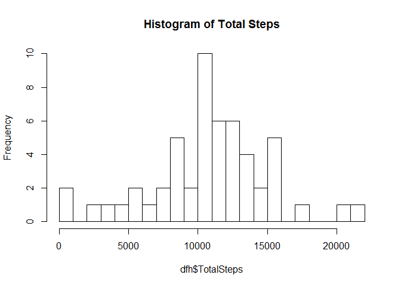
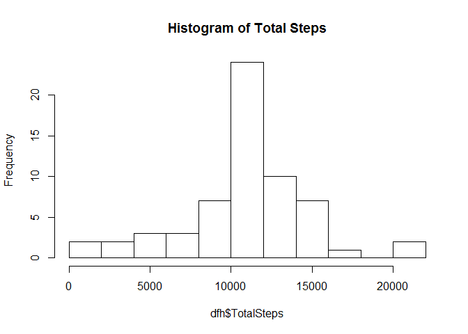
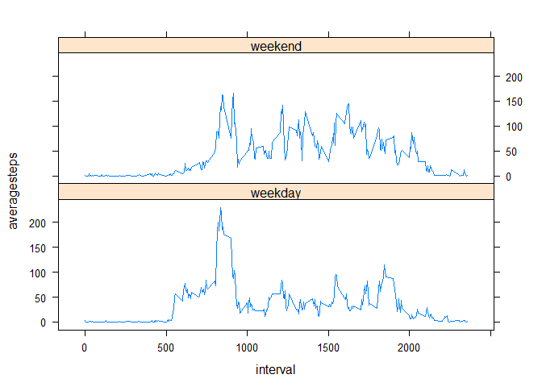

# Reproducible Research: Peer Assessment 1

# Adrian Lim June 2015
## Loading and preprocessing the data
Uncompress the activity.zip file and read it

```r
filename <- unzip("activity.zip")
df <- read.csv("activity.csv",header = TRUE,na.strings = "NA",sep = ",")
str(df)
```

```
## 'data.frame':	17568 obs. of  3 variables:
##  $ steps   : int  NA NA NA NA NA NA NA NA NA NA ...
##  $ date    : Factor w/ 61 levels "2012-10-01","2012-10-02",..: 1 1 1 1 1 1 1 1 1 1 ...
##  $ interval: int  0 5 10 15 20 25 30 35 40 45 ...
```
Convert the date string into proper Date format

```r
library("dplyr")
```

```
## 
## Attaching package: 'dplyr'
## 
## The following object is masked from 'package:stats':
## 
##     filter
## 
## The following objects are masked from 'package:base':
## 
##     intersect, setdiff, setequal, union
```

```r
library("lattice")
df <- mutate(df,date = as.Date(date, format = '%Y-%m-%d'))
str(df)
```

```
## 'data.frame':	17568 obs. of  3 variables:
##  $ steps   : int  NA NA NA NA NA NA NA NA NA NA ...
##  $ date    : Date, format: "2012-10-01" "2012-10-01" ...
##  $ interval: int  0 5 10 15 20 25 30 35 40 45 ...
```
## What is mean total number of steps taken per day?
Filter out the rows with missing values (denoted by 'NA')  

```r
num <- nrow(df)
dfnoNA <- filter(df,steps != "NA")
num1 <- nrow(dfnoNA)
numNA <- num - num1
```
Number of rows without missing values(NA) is 15264.  
Number of rows with missing values(NA) is 2304  
  
1) Group data by each day then sum up the number of steps for that day.  
2) Plot a histogram of the Total Steps.    

```r
dfnoNA <- group_by(dfnoNA,date) 
dfh <- summarise(dfnoNA,TotalSteps = sum(steps))
hist(dfh$TotalSteps,main="Histogram of Total Steps",breaks=10)
```

 
  
3) Calculate the mean and median of the total number of steps taken per day

```r
mean <- summarise(dfh,mean(TotalSteps))
median <- summarise(dfh,median(TotalSteps))
```
Mean is 1.0766189\times 10^{4}  
Median is 10765

## What is the average daily activity pattern?
1) Make a time series plot of the 5 minute interval(x axis) and the average  
number of steps taken, averaged across all days(y axis)

```r
dfnoNA <- tapply(dfnoNA$steps,dfnoNA$interval,mean)
head(dfnoNA)
```

```
##         0         5        10        15        20        25 
## 1.7169811 0.3396226 0.1320755 0.1509434 0.0754717 2.0943396
```

```r
plot(y=dfnoNA,x=names(dfnoNA),type='l',main="Average Number of Steps by Interval",xlab="Interval",ylab="Average Number of Steps")
```

 
  
2) The 5 minute interval containing the maximum number of steps is

```r
dfnoNA[dfnoNA == max(dfnoNA)]
```

```
##      835 
## 206.1698
```
## Imputing missing values
1) Our original dataframe had 2304 missing values. For example if we look at the head of the original dataframe:  

```r
head(df)
```

```
##   steps       date interval
## 1    NA 2012-10-01        0
## 2    NA 2012-10-01        5
## 3    NA 2012-10-01       10
## 4    NA 2012-10-01       15
## 5    NA 2012-10-01       20
## 6    NA 2012-10-01       25
```
2) We can replace those missing values with the mean of the steps for the same interval from other days which are not missing data.  
3) Lets store this new dataset in the dataframe dfnew  

```r
dfnew <- df
dfnew[which(is.na(dfnew$steps)),1] <- dfnoNA[as.character(dfnew[which(is.na(dfnew$steps)),3])]
head(dfnew)
```

```
##       steps       date interval
## 1 1.7169811 2012-10-01        0
## 2 0.3396226 2012-10-01        5
## 3 0.1320755 2012-10-01       10
## 4 0.1509434 2012-10-01       15
## 5 0.0754717 2012-10-01       20
## 6 2.0943396 2012-10-01       25
```

```r
sum(is.na(dfnew))
```

```
## [1] 0
```
4) As can be seen from above, there is no longer any missing data.  
Lets plot a histogram of the new dataframe  

```r
dfnew <- group_by(dfnew,date) 
dfh <- summarise(dfnew,TotalSteps = sum(steps))
hist(dfh$TotalSteps,main="Histogram of Total Steps",breaks=10)
```

 


```r
mean <- summarise(dfh,mean(TotalSteps))
median <- summarise(dfh,median(TotalSteps))
```
Mean of the dataframe with imputed values is 1.0766189\times 10^{4}  
Median of the dataframe with imputed values is 1.0766189\times 10^{4}  
There is not much difference to the values we had before imputing the values apart from the obvious increase in frequency for some of the intervals because there is now more data points. The shape of the histogram is similiar to the one before so    
We can conclude that our methodology of imputing data is acceptable as it does not change the mean and median significantly.

## Are there differences in activity patterns between weekdays and weekends?
Separate out weekdays from weekends by using the weekdays function to find out the actual weekday from the date and categorising it in the new daytype column

```r
wd <- weekdays(dfnew$date)
dfnew$daytype <- factor(wd,levels <- c('weekday','weekend'))
dfnew$daytype[] <- 'weekday'
dfnew$daytype[wd %in% c('Saturday','Sunday')] <- 'weekend'
head(dfnew)
```

```
## Source: local data frame [6 x 4]
## Groups: date
## 
##       steps       date interval daytype
## 1 1.7169811 2012-10-01        0 weekday
## 2 0.3396226 2012-10-01        5 weekday
## 3 0.1320755 2012-10-01       10 weekday
## 4 0.1509434 2012-10-01       15 weekday
## 5 0.0754717 2012-10-01       20 weekday
## 6 2.0943396 2012-10-01       25 weekday
```
Plot a graph comparing average daily steps by interval on the weekends versus the weekdays  

```r
dfnew <- group_by(dfnew,interval,daytype)
dfnew <- summarise(dfnew,averagesteps = mean(steps))
head(dfnew)
```

```
## Source: local data frame [6 x 3]
## Groups: interval
## 
##   interval daytype averagesteps
## 1        0 weekday   2.25115304
## 2        0 weekend   0.21462264
## 3        5 weekday   0.44528302
## 4        5 weekend   0.04245283
## 5       10 weekday   0.17316562
## 6       10 weekend   0.01650943
```

```r
xyplot(averagesteps ~ interval | daytype,data=dfnew,type='l',layout=c(1,2))
```

 

We can see the differences between the two plots:  
- 1) Subject wakes up earlier on the weekdays compared to the weekends which makes sense as subject needs to go to work.    
- 2) There seems to be consistent spike of activity around 830-930am during the weekdays (walking to work maybe?)  
- 3) There is a more even level of activity throughout the day on the weekends
compared to weekdays which again makes sense as the subject is probably deskbound on the weekday.
