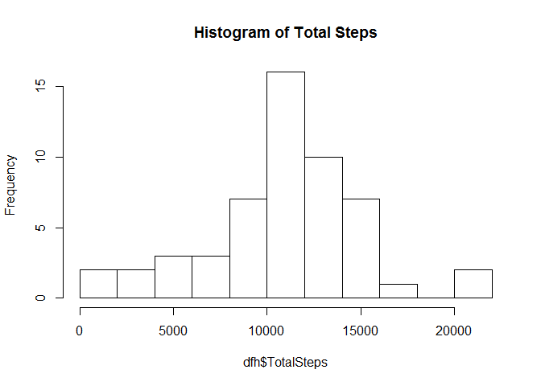

# Reproducible Research: Peer Assessment 1

# Adrian Lim June 2015
## Loading and preprocessing the data
Uncompress the activity.zip file and read it

```r
filename <- unzip("activity.zip")
df <- read.csv("activity.csv",header = TRUE,na.strings = "NA",sep = ",")
str(df)
```

```
## 'data.frame':	17568 obs. of  3 variables:
##  $ steps   : int  NA NA NA NA NA NA NA NA NA NA ...
##  $ date    : Factor w/ 61 levels "2012-10-01","2012-10-02",..: 1 1 1 1 1 1 1 1 1 1 ...
##  $ interval: int  0 5 10 15 20 25 30 35 40 45 ...
```
Convert the date string into proper Date format

```r
library("dplyr")
```

```
## 
## Attaching package: 'dplyr'
## 
## The following object is masked from 'package:stats':
## 
##     filter
## 
## The following objects are masked from 'package:base':
## 
##     intersect, setdiff, setequal, union
```

```r
df <- tbl_df(df)
df <- mutate(df,date = as.Date(date, format = '%Y-%m-%d'))
str(df)
```

```
## Classes 'tbl_df', 'tbl' and 'data.frame':	17568 obs. of  3 variables:
##  $ steps   : int  NA NA NA NA NA NA NA NA NA NA ...
##  $ date    : Date, format: "2012-10-01" "2012-10-01" ...
##  $ interval: int  0 5 10 15 20 25 30 35 40 45 ...
```
## What is mean total number of steps taken per day?
Filter out the rows with missing values (denoted by 'NA')  

```r
num <- nrow(df)
dfnoNA <- filter(df,steps != "NA")
num1 <- nrow(dfnoNA)
numNA <- num - num1
```
Number of rows without missing values(NA) is 17568.  
Number of rows with missing values(NA) is 2304  
  
1) Group data by each day then sum up the number of steps for that day.  
2) Plot a histogram of the Total Steps.    

```r
dfnoNA <- group_by(dfnoNA,date) 
dfnoNA <- summarise(dfnoNA,TotalSteps = sum(steps))
hist(dfnoNA$TotalSteps,main="Histogram of Total Steps",breaks=20)
```

 
  
3) Calculate the mean and median of the total number of steps taken per day

```r
mean <- summarise(dfnoNA,mean(TotalSteps))
median <- summarise(dfnoNA,median(TotalSteps))
```
Mean is 1.0766189\times 10^{4}  
Median is 10765

## What is the average daily activity pattern?


## Imputing missing values


## Are there differences in activity patterns between weekdays and weekends?
